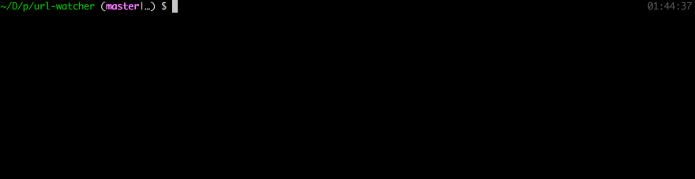

# url-watcher

[](https://opensource.org/licenses/Apache-2.0)
[](https://www.npmjs.com/package/url-watcher)

Simple CLI to monitor website downtime. useful for measuring "zero downtime deployments".



## Usage

By default it makes a request every `100ms` with a `500ms` request timeout. Hit `Ctrl + c` to stop watching.

```sh
npx url-watcher http://www.twitter.com
```
